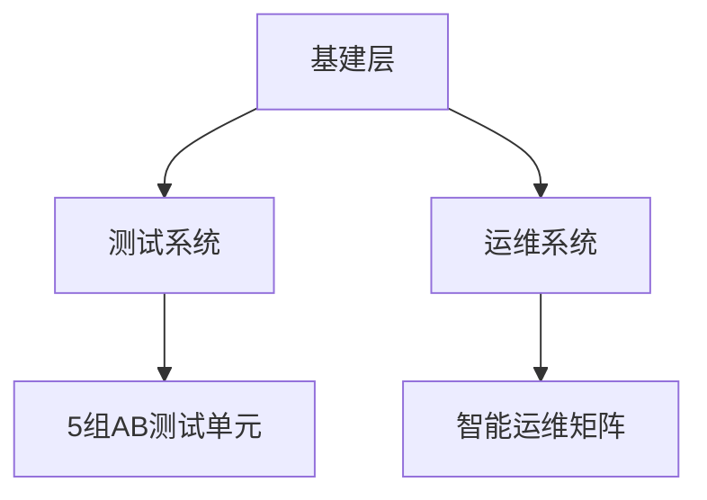

# Meta广告账户全流程优化解决方案

---

## 账户体系架构设计
### 动态管理模型


### 域名管理规范
| 名称       | 用途定位        | 绑定资产        | 预算占比  |
|------------|---------------|----------------|-----------|
| 核心域名   | 主转化路径     | 官方BM系统     | 65%       |
| 镜像域名   | 复购用户对接   | 企业支付账户   | 20%       |
| 实验域名   | 新模式测试     | 独立分析系统   | 15%       |

---

## 创意素材管理工程
### 生命周期模型
```process-cycle
创意产出 → 版本测试 → 数据监控 → 策略迭代
    ↓            ↓            ↓          ↓
场景适配     衰退预警     效果评级     沉淀知识库
```

### 视频质量基准
| 质量维度   | 达标参数               | 检测工具          |
|------------|-----------------------|-------------------|
| 内容相关性 | 前3秒跳出率≤45%       | Facebook质检系统  |
| 声画同步   | 时间差≤0.12秒         | Adobe Premiere    |
| 移动适配   | 竖屏占比≥80%          | Resolution Check  |

---

## 智能预算分配算法
### 动态调节公式
```math
日预算 = 基准预算 × \frac{CTR_{实时}}{CTR_{基准}} × \sqrt{素材新鲜度}
```
| 调节因子   | 权重系数  | 监测频率  |
|------------|----------|-----------|
| 时段波动   | 0.4      | 每小时     |
| 竞品动作   | 0.3      | 每天       |
| 用户活跃   | 0.2      | 实时       |
| 系统预警   | 0.1      | 即时响应   |

---

## 风险防控体系构建
### 安全认证架构
| 层级       | 验证方式                | 响应时效  |
|------------|-----------------------|-----------|
| 基础防护   | 设备指纹识别           | 实时      |
| 行为分析   | 操作路径建模           | <5秒      |
| 生物认证   | 面部动态捕捉           | <3秒      |
| 人工复核   | 异常行为三级审核       | <30分钟   |

### 账户健康标准
```health-checklist
- 周违规率 < 0.15%
- 日预算波动 ≤ 12%
- 素材通过率 ≥ 97%
- 受众更新周期 ≤ 3天
```

---

## 再营销深度运营
### 用户挽回策略
```user-recovery
认知阶段 → 兴趣阶段 → 决策阶段 → 行动阶段
   ↓          ↓           ↓          ↓
精准定位    痛点强化    限时激励    快捷支付
```

### 分阶段动作设置
| 阶段特征          | 实施动作                     | 核心指标          |
|-------------------|----------------------------|-------------------|
| 浏览超过5个产品   | 产品对比图文推送            | 加购率提升35%     |
| 收藏未购买        | 动态价格提醒                | 转化成本降低28%   |
| 加入购物车        | 倒计时优惠券                | 结账率提高42%     |
| 支付失败          | 备选支付方式引导            | 挽回成功率58%     |

---

## 效能评估体系
### 核心看板设计
```dashboard
[核心维度]
  用户质量：新客占比 / 复购率 / LTV值
  成本效益：CPC健康值 / ROAS达标率 
  运营安全：账户存活周期 / 违规处置时效

[智能预警]
  实时竞争指数波动≥15% → 启动防御预案
  素材衰减指数>0.8 → 自动打标替换
```

> **操作建议**：建议每日10:00/16:00/22:00执行三次策略校准，每周五进行全维度健康筛查。新产品上线前至少配置3组预备方案，确保异常情况下5分钟内启动应急投放策略。
[教学视频](https://youtube.com/shorts/T4dla2L5uGE?feature=share)
